# Architecture

## Document Control

- Project: CRM System
- Phase: G5 Architecture Design
- Owner Agent: Architecture
- Status: Revised for G5 Re-review
- Date: 2026-05-30
- Source Inputs:
  - `PROJECT_CONTEXT.md`
  - `STANDARD-APPLICATION-INDEX.md`
  - `docs/product/prd.md`
  - `docs/product/acceptance-matrix.md`
  - `docs/product/business-capability-map.md`
  - `docs/business/service-governance-inputs.md`
  - `docs/ux-ui/service-state-mapping.md`
  - `docs/security/service-boundary-security.md`

## Overview

The CRM System will use a physical multi-service architecture for v1.

The deployment runtime host is one Volcengine ECS server (`srv-volcengine-sh-01`)
running Docker Compose, with a second Alibaba Cloud ECS server (`srv-aliyun-bj-01`)
as the off-server backup target only. Each Go backend service runs in its own
Docker container. PostgreSQL is self-hosted in a Docker container on the runtime
host. A reverse proxy exposes only the web/API entrypoint. Backend services
communicate only on the internal Docker network. See `deployment-notes.md` for
the registered assets and runtime-host co-location constraints.

The architecture follows service-boundary-first governance and physically
separates service runtime containers from the start. Service boundaries are
based on business capabilities and DDD bounded-context candidates, not pages,
controllers, tables, or technical layers.

## Architecture Goals

- Support the full P0/P1 ToB CRM loop without mock, static-only, TODO,
  in-memory-only, or non-persistent core paths.
- Preserve high cohesion by keeping each service responsible for one business
  capability area.
- Preserve low coupling by requiring public API or event contracts for all
  cross-service collaboration.
- Enforce database ownership through independent PostgreSQL database or schema
  permissions per service.
- Provide architecture artifacts that Domain Modeling can represent in PSM.
- Provide contract, data, permission, integration, and deployment constraints
  for Task Planner, QA TDD, Integration Owner, and Audit.

## Constraints

- Product: P0/P1 acceptance items in `docs/product/acceptance-matrix.md` are the
  source of truth and cannot be downgraded, deleted, merged away, weakened, or
  accepted as partial work.
- Business: the system must support the complete v1 ToB CRM loop from lead to
  customer/contact, opportunity, quote, contract, payment, closure, activity,
  reminders, history, reporting, and import/export.
- UX/UI: API and error contracts must support loading, empty, validation,
  permission denied, blocked transition, conflict, partial failure, long-running
  operation, read-only history, sensitive display, and archived context states.
- Security: frontend hiding or disabling actions is not authorization. Backend
  services must enforce role, record scope, service-to-service authorization,
  safe errors, auditability, and sensitive data handling.
- Technical: backend services use Go; runtime isolation uses Docker containers;
  orchestration uses Docker Compose for v1; persistence uses PostgreSQL.
- Operations: production runtime host is Volcengine ECS (`srv-volcengine-sh-01`)
  with Alibaba Cloud ECS (`srv-aliyun-bj-01`) as the off-server backup target;
  PostgreSQL local backups are automatic, timestamped, encrypted, and retained
  for 7 days. Production release also requires off-server backup copy evidence to
  the Alibaba host; same-host-only backup is a release-blocking gap, not an
  accepted P0/P1 completion state.
- Public access: production login/session traffic is HTTPS-only. IP-based
  internal validation is allowed before release, but production ACC-017 evidence
  must record the final domain or approved endpoint, TLS certificate, security
  group rules, health checks, monitoring target, and backup evidence.

## Service Architecture Strategy

| Decision | Value | Rationale |
|---|---|---|
| Service strategy | Physical multi-service from v1 | User selected multiple Go microservices with Docker isolation. |
| Runtime orchestration | Docker Compose on Volcengine ECS runtime host `srv-volcengine-sh-01` | Fits current infrastructure and team scale; avoids Kubernetes complexity in v1. |
| Database deployment | Self-hosted PostgreSQL Docker container on the runtime host | User selected self-hosted database on the runtime host resource. |
| Data isolation | One PostgreSQL instance, service-isolated database or schema plus service account | Balances operational simplicity with service ownership and forbidden cross-service data access. |
| External access | Reverse proxy exposes only web/API entrypoint | Reduces public attack surface and keeps service network internal. |
| Backup | Local automatic encrypted daily backup, timestamped, retain 7 days, plus off-server production backup requirement | Local backup matches user-selected baseline; same-host-only backup remains a production release blocker. |
| Production entry | HTTPS-only through reverse proxy | Login/session traffic cannot use plaintext HTTP in production. HTTP may only redirect to HTTPS. |
| Internal trust | Authenticated service-to-service calls | Docker internal network is a transport boundary, not a trust boundary. |

## Service List

| Service ID | Service | Bounded Context / Capability | Service Owner Agent | Deployment Boundary | Primary Acceptance IDs |
|---|---|---|---|---|---|
| SVC-001 | gateway-bff | API entry, frontend aggregation, request routing | backend-engineer | Independent container | ACC-001 to ACC-023 |
| SVC-002 | identity-authz-service | Identity and role access | backend-engineer | Independent container | ACC-001, ACC-002, ACC-022 |
| SVC-003 | lead-service | Lead intake and qualification | backend-engineer | Independent container | ACC-003, ACC-004, ACC-019 |
| SVC-004 | account-service | Account and contact management | backend-engineer | Independent container | ACC-005, ACC-006, ACC-019 |
| SVC-005 | opportunity-service | Opportunity pipeline | backend-engineer | Independent container | ACC-007, ACC-008, ACC-013 |
| SVC-006 | commercial-service | Quote, contract, and payment lifecycle | backend-engineer | Independent container | ACC-009, ACC-010, ACC-011, ACC-013, ACC-021 |
| SVC-007 | work-service | Activities, notes, tasks, and reminders | backend-engineer | Independent container | ACC-012, ACC-021 |
| SVC-008 | audit-history-service | Record-local history and operation logs | backend-engineer | Independent container | ACC-014, ACC-022 |
| SVC-009 | reporting-service | Team overview, reports, and read models | backend-engineer | Independent container | ACC-018, ACC-023 |
| SVC-010 | import-export-service | CSV import/export runs and row results | backend-engineer | Independent container | ACC-020, ACC-022 |

Every service currently has exactly one `Service Owner Agent`. G8 task planning
may introduce more specialized project agents later, but cannot remove service
ownership.

## Topology

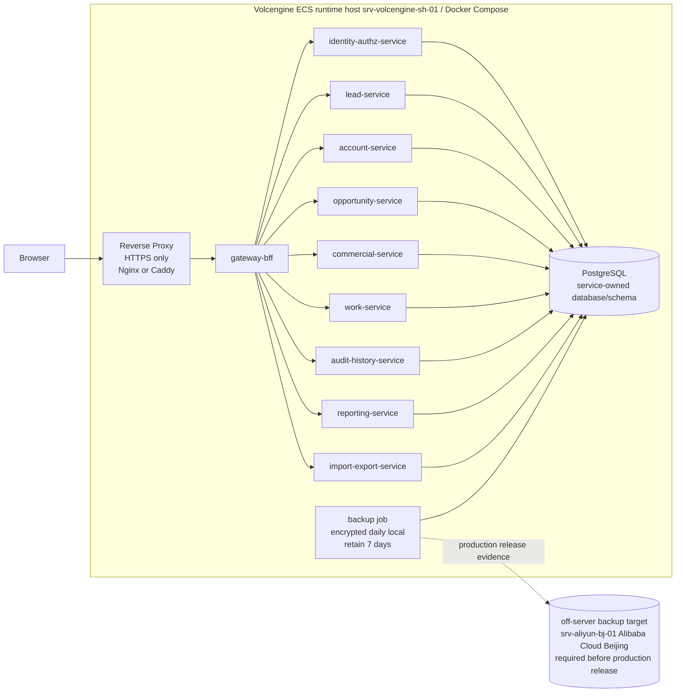

Only the reverse proxy and web/API entrypoint are exposed outside the host.
Database and internal service ports are not publicly exposed.

## Service Data Boundary Diagram

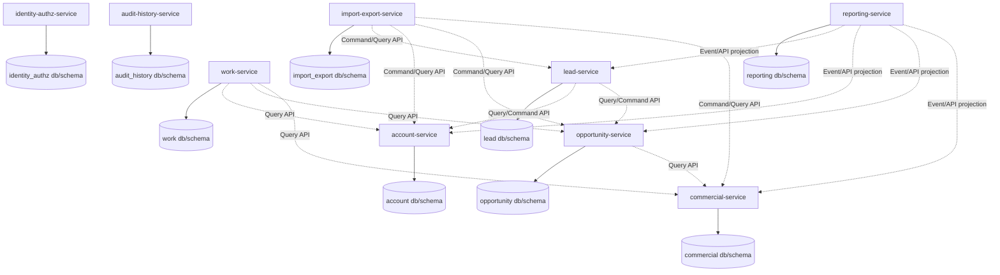

Each solid arrow is a service accessing only its own database/schema. Each
dotted arrow is a public business API, event projection, or approved read-model
interaction. Dotted arrows are not database access.

## Core Service Flow Matrix

| Flow ID | Flow | Primary Services | Supporting Services | Acceptance IDs | Detail |
|---|---|---|---|---|---|
| ARCH-FLOW-001 | Sign in and protected work | gateway-bff, identity-authz-service | target service, audit-history-service | ACC-001, ACC-002, ACC-022 | See sequence below. |
| ARCH-FLOW-002 | Lead to opportunity | lead-service, account-service, opportunity-service | gateway-bff, identity-authz-service, audit-history-service, reporting-service | ACC-003 to ACC-007, ACC-014, ACC-019 | See sequence below. |
| ARCH-FLOW-003 | Opportunity to quote and contract | opportunity-service, commercial-service | identity-authz-service, audit-history-service, reporting-service | ACC-007 to ACC-010, ACC-014 | See sequence below. |
| ARCH-FLOW-004 | Payment to Won | commercial-service, opportunity-service | identity-authz-service, audit-history-service, reporting-service | ACC-011, ACC-013, ACC-014 | See sequence below. |
| ARCH-FLOW-005 | Work reminders | work-service, commercial-service | record-owning services, identity-authz-service | ACC-012, ACC-021 | See sequence below. |
| ARCH-FLOW-006 | Import/export | import-export-service, target domain services | identity-authz-service, audit-history-service | ACC-016, ACC-020, ACC-022 | See sequence below. |
| ARCH-FLOW-007 | Reports and overview | reporting-service | source service events/APIs, identity-authz-service | ACC-018, ACC-023 | See sequence below. |
| ARCH-FLOW-008 | Backup and restore | PostgreSQL, backup job | runtime services, infrastructure-ops | ACC-016, ACC-017, ACC-022 | See sequence below. |
| ARCH-FLOW-009 | Archive eligibility and active obligations | record-owning services | work-service, commercial-service, audit-history-service | ACC-005, ACC-007, ACC-010, ACC-012, ACC-014 | See sequence below. |
| ARCH-FLOW-010 | Owner transfer and open work transfer | lead/account/opportunity services, work-service | identity-authz-service, audit-history-service | ACC-003, ACC-005, ACC-007, ACC-012, ACC-014 | See sequence below. |
| ARCH-FLOW-011 | Close Lost and terminal edit protection | opportunity-service | work-service, audit-history-service, reporting-service | ACC-013, ACC-014, ACC-021 | See sequence below. |
| ARCH-FLOW-012 | Duplicate warning and proceed-after-warning | lead-service, account-service | gateway-bff, identity-authz-service | ACC-019 | See sequence below. |

## Sequence: Sign In And Protected Work

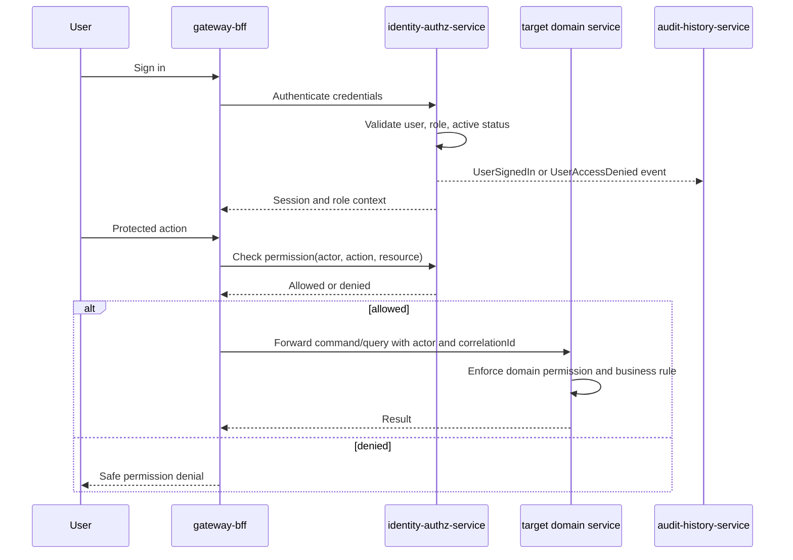

## Sequence: Lead To Opportunity

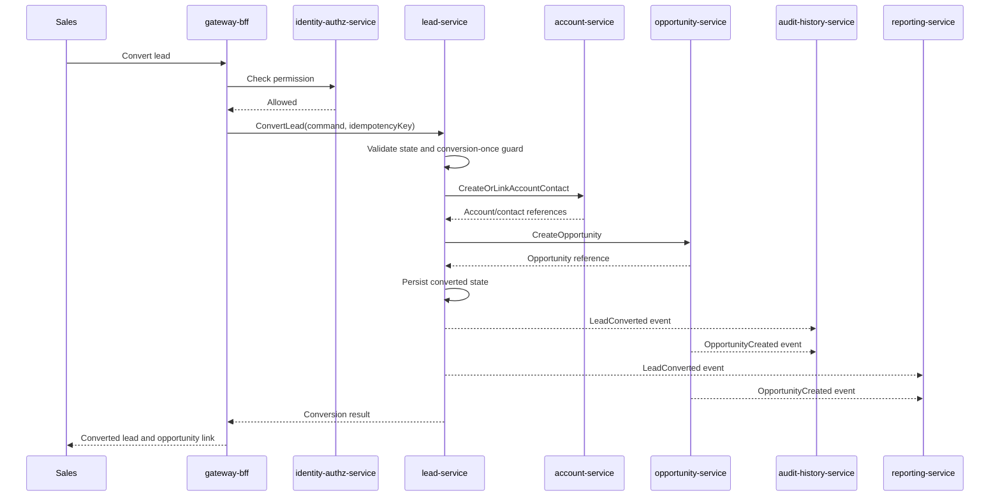

## Sequence: Opportunity To Quote And Contract

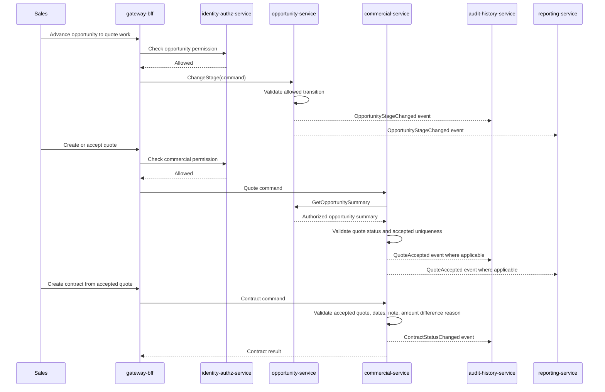

## Sequence: Payment To Won

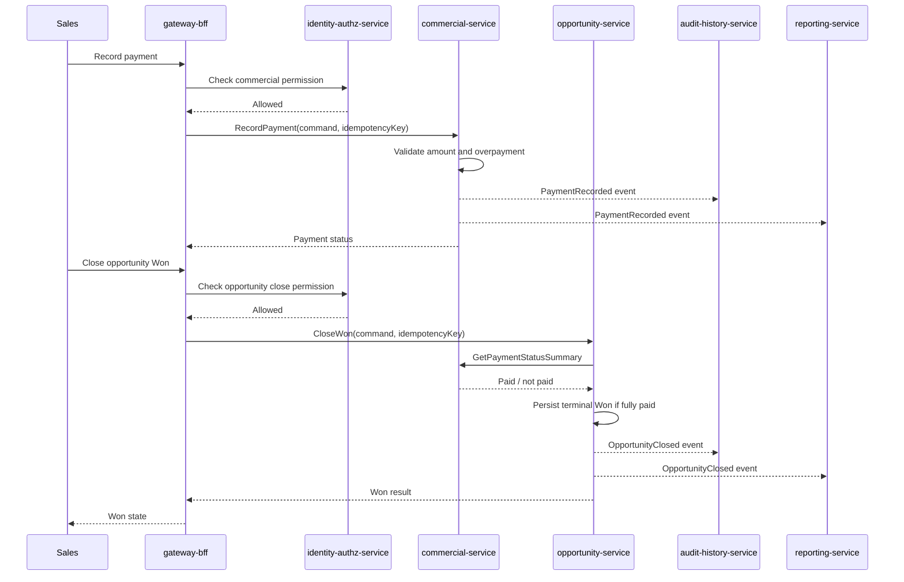

## Sequence: Work Reminders

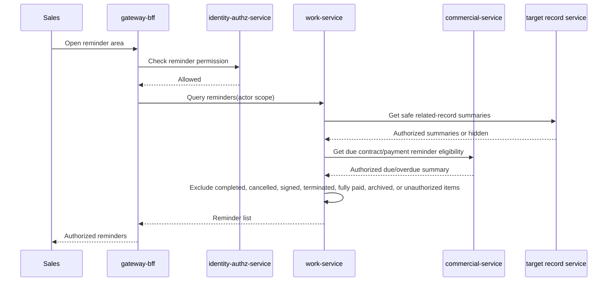

## Sequence: Import / Export

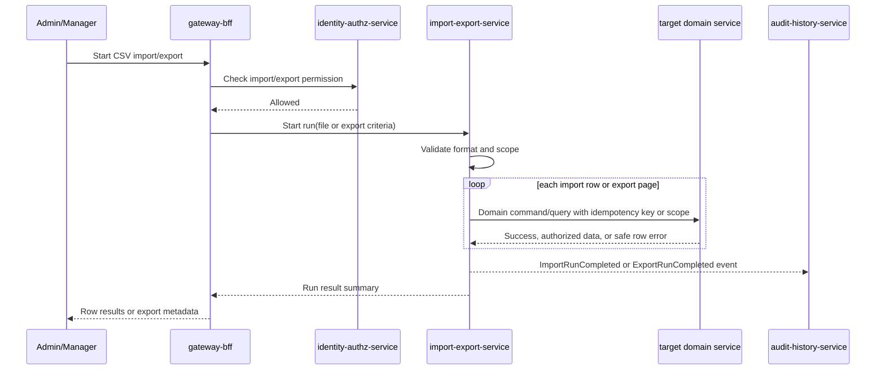

## Sequence: Reports And Overview

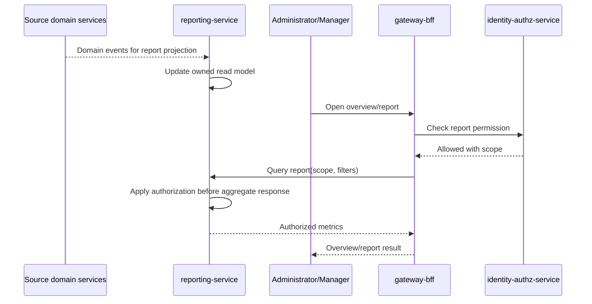

## Sequence: Backup And Restore Evidence

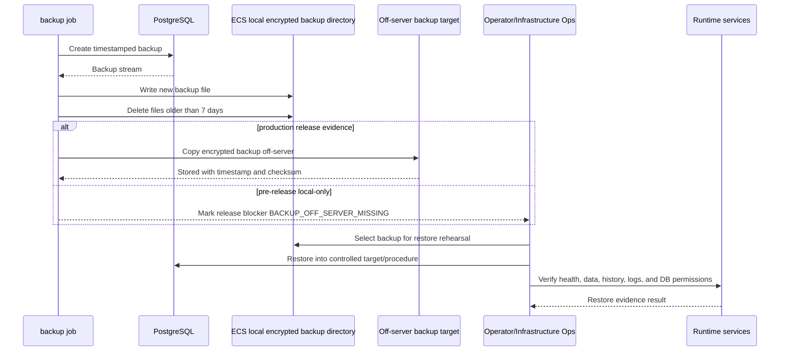

## Sequence: Archive Eligibility And Active Obligations

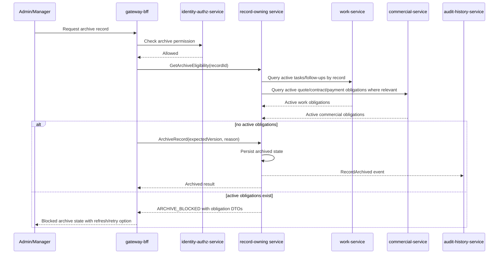

## Sequence: Owner Transfer And Open Work Transfer

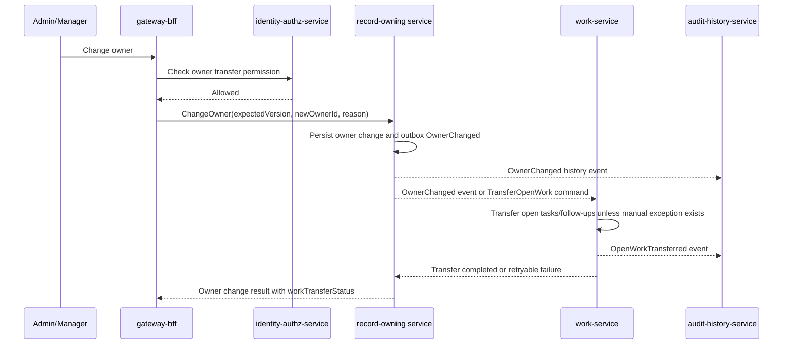

If open work transfer fails, the owning service must expose
`workTransferStatus = PendingRetry | Failed` and the work-service must retry by
idempotency key. A manual reassignment exception requires Administrator or Sales
Manager permission and a required reason.

## Sequence: Close Lost And Terminal Edit Protection

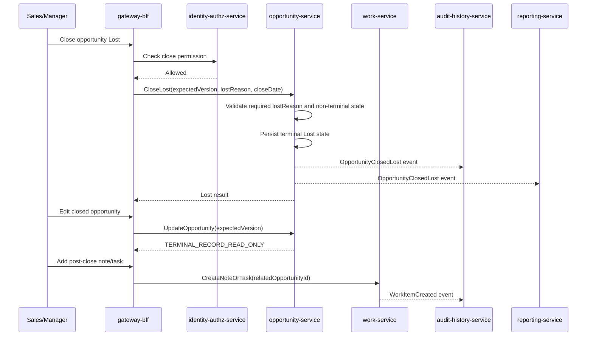

Won/Lost are terminal opportunity states in v1. Post-close notes and follow-up
tasks are allowed through work-service only; they do not reopen or edit the
closed opportunity.

## Sequence: Duplicate Warning And Proceed-After-Warning

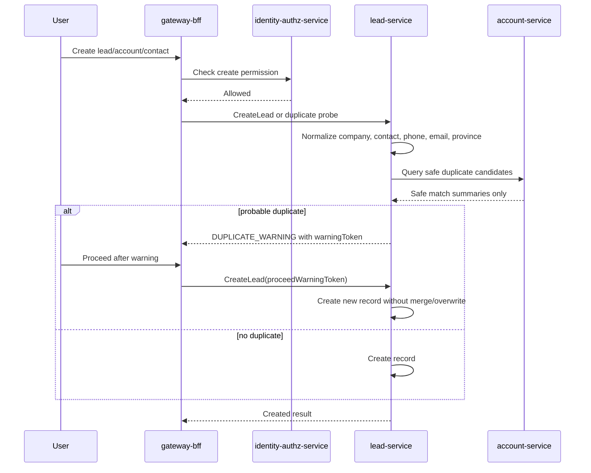

## Architecture Principles

- A service owns its own data and writes its own data.
- No service may receive, request, or use another service's database
  credentials.
- Cross-service reads must use target service Query API, events, or an approved
  read model.
- Cross-service writes must use target service Command API.
- Shared packages may contain contracts, DTO schemas, constants, and generated
  clients only. Shared business implementation is prohibited.
- Core CRM records are never hard-deleted in v1. They are closed, terminated,
  archived, or moved through explicit lifecycle states.
- Reporting is based on an owned read model or target service APIs, not direct
  cross-service table reads.
- Import/export must call domain services and cannot bypass validation,
  authorization, history, or audit rules.
- Audit/history must be durable and append-only through normal CRM workflows.
- Editable P0 records must expose a concurrency token. Mutating commands must
  include `expectedVersion` and return `VERSION_CONFLICT` when stale.
- Archive, owner transfer, close Won/Lost, quote acceptance, contract status,
  payment, import/export, and user lifecycle changes must create history or
  operation log events.

## Key Design Decisions

| Decision ID | Decision | Status | Notes |
|---|---|---|---|
| ADR-ARCH-001 | Use physical multi-service Go backend with Docker Compose on one runtime host (`srv-volcengine-sh-01`, Volcengine ECS); `srv-aliyun-bj-01` is the off-server backup target only. | Accepted for G5 Re-review | Details in `service-architecture-adr.md`. |
| ADR-ARCH-002 | Use one self-hosted PostgreSQL instance with service-isolated database/schema and users. | Accepted for G5 Re-review | Direct cross-service database access is forbidden. |
| ADR-ARCH-003 | Use local automatic encrypted PostgreSQL backups with 7-day retention as baseline. | Accepted for pre-release only | Same-host-only backup is a production release blocker until off-server backup evidence exists. |
| ADR-ARCH-004 | Do not create a unified database CRUD service. | Accepted | Services expose business APIs, not database operation APIs. |
| ADR-ARCH-005 | Enforce HTTPS-only production ingress and authenticated service-to-service calls. | Accepted for G5 Re-review | Details in `authz-architecture.md` and `deployment-notes.md`. |

## G5 Handoff To MDA

Domain Modeling must represent these architecture decisions in PSM:

- service mapping and bounded contexts
- aggregate ownership and data ownership
- public API, event, error, permission, and DTO contracts
- service-to-service permission rules
- state machines and failure paths
- idempotency, timeout, retry, compensation, and correlation ID rules
- backup, restore, deployment, and observability constraints
- forbidden cross-service imports and forbidden database access

## Gate Status

This architecture package is revised for G5 re-review. G5 is not passed until
Product Manager, Business Analyst, UX Designer, UI Designer, and Security
Compliance review it and no P0/P1 blocker remains.
