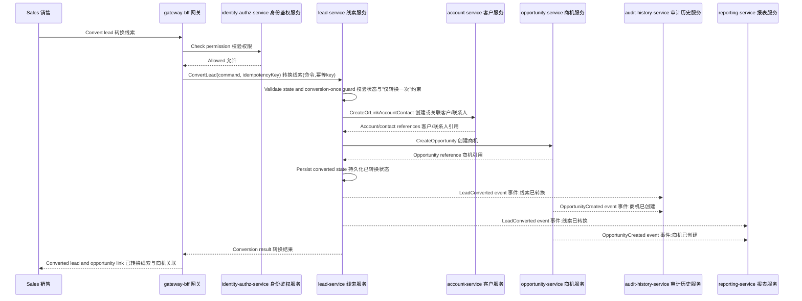
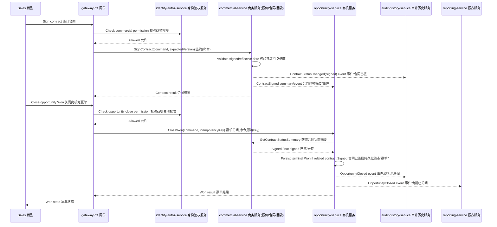
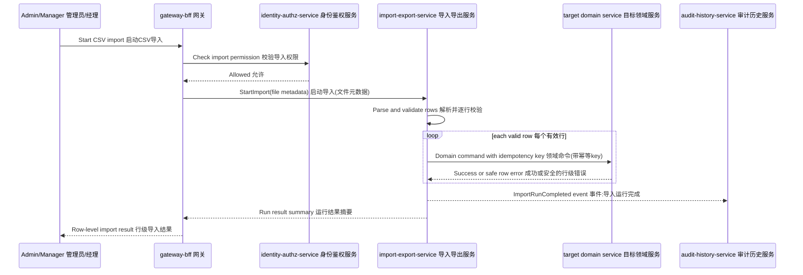
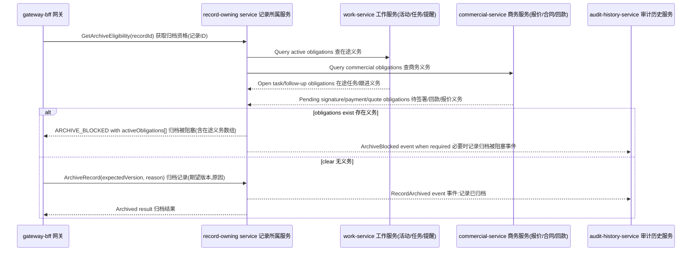

# Integration Design

## Document Control

- Project: CRM System
- Phase: G5 Architecture Design
- Owner Agent: Architecture
- Status: Revised for G5 Re-review
- Date: 2026-05-30

## Integration Strategy

The CRM uses internal service APIs for synchronous commands and queries, plus
domain events for history, reporting, reminders, and integration evidence.

All cross-service interactions must include:

- correlation ID
- caller service identity
- actor context where user initiated
- timeout
- retry policy when safe
- idempotency key for writes
- safe error handling
- audit/history behavior where applicable

## Cross-Service Flow Matrix

| Flow ID | Flow | Primary Flow Owner Agent | Services | Sync Calls | Events | Failure Recovery | Correlation ID |
|---|---|---|---|---|---|---|---|
| INT-FLOW-001 | Sign in and protected work | backend-engineer | gateway-bff, identity-authz-service, target service, audit-history-service | auth/session, permission check | UserSignedIn, UserAccessDenied | Deny safely; no target mutation. | Required |
| INT-FLOW-002 | Lead to opportunity | backend-engineer | gateway-bff, identity-authz-service, lead-service, account-service, opportunity-service, audit-history-service, reporting-service | permission, create/link account/contact, create opportunity | LeadConverted, OpportunityCreated | Idempotent conversion; converted lead cannot convert again; failed downstream call leaves no false success. | Required |
| INT-FLOW-003 | Opportunity to quote/contract | backend-engineer | opportunity-service, commercial-service, audit-history-service, reporting-service | opportunity summary, commercial commands | QuoteAccepted, ContractStatusChanged | Reject invalid links; maintain history on successful mutation. | Required |
| INT-FLOW-004 | Contract signing to Won (payment tracked post-sale) | backend-engineer | commercial-service, opportunity-service, audit-history-service, reporting-service | contract signed verification | ContractStatusChanged(Signed), OpportunityClosed | Won requires Signed contract (DEC-017); payment decoupled (DEC-019), overpayment still rejected on payment; early Won rejected; retry safe by idempotency key. | Required |
| INT-FLOW-005 | Work reminders | backend-engineer | work-service, commercial-service, opportunity-service, account-service, audit-history-service | related record summary/eligibility | TaskStatusChanged, PaymentOverdue, ContractStatusChanged | Hide unauthorized/inactive records; stale reminder refresh. | Required |
| INT-FLOW-006 | Record history and operation logs | backend-engineer | source services, audit-history-service | append/query log APIs where needed | OperationLogAppended, HistoryEventAppended | Source operation must define behavior if audit append fails. P0 sensitive mutations require reliable history path. | Required |
| INT-FLOW-007 | Reports and overview | backend-engineer | source services, reporting-service, identity-authz-service | report query, optional projection rebuild | source domain events, ReportProjectionUpdated | Rebuild projection from approved contracts if projection stale. | Required |
| INT-FLOW-008 | CSV import/export | backend-engineer | import-export-service, target services, audit-history-service, reporting-service | target service commands/queries | ImportRunCompleted, ExportRunCompleted | Row-level failure isolation; valid rows do not corrupt existing records. | Required |
| INT-FLOW-009 | Backup and restore | infrastructure-ops | PostgreSQL, backup job, runtime services | health and restore checks | operational log event candidate | Restore rehearsal before launch; same-host backup risk recorded. | Required for evidence |
| INT-FLOW-010 | Archive eligibility | backend-engineer | record-owning services, work-service, commercial-service, audit-history-service | obligation checks, archive command | RecordArchived, ArchiveBlocked candidate | Block archive when active obligations exist; return obligation DTO and retry after refresh. | Required |
| INT-FLOW-011 | Owner transfer and open work transfer | backend-engineer | record-owning services, work-service, audit-history-service | owner transfer command, open work transfer command/query | OwnerChanged, OpenWorkTransferred | Idempotent transfer; retry pending transfer; manual exception requires privileged reason. | Required |
| INT-FLOW-012 | Duplicate warning | backend-engineer | lead-service, account-service, identity-authz-service | safe duplicate lookup, proceed-after-warning command | DuplicateWarningRaised | No merge/overwrite; warning token is single-use and idempotent with command key. | Required |
| INT-FLOW-013 | Close Lost terminal lifecycle | backend-engineer | opportunity-service, work-service, audit-history-service, reporting-service | close lost command, post-close work command | OpportunityClosedLost, WorkItemCreated | Lost reason required; later edits rejected; notes/tasks remain allowed through work-service. | Required |

## Lead Conversion Sequence

## Contract Signing To Won Sequence (payment tracked post-sale)

Won fires when the related contract is Signed (DEC-017). Payment recording is a
separate post-sale flow (decoupled from Won, DEC-019) and does not gate closure.

## Import Sequence

## Archive Eligibility Sequence

## Owner Transfer Reliability

Owner transfer uses an idempotent owner transfer command plus an
`OwnerChanged` event. The record-owning service owns the record owner state.
work-service owns task and follow-up assignment state.

Required recovery behavior:

- The owner change command returns `workTransferStatus`.
- `Completed` means all open task/follow-up ownership was transferred or a
  privileged manual exception was recorded.
- `PendingRetry` means owner change is saved and work transfer is queued for
  retry by event ID/idempotency key.
- `Failed` means retry budget is exhausted and the record is blocked for
  operator review before release evidence can pass.
- Every status change emits history/operation log evidence.

## Import / Export Integration Scope

Committed import/export target routing:

| Object Type | Target Service | Mutation / Query Rule |
|---|---|---|
| Lead | lead-service | Import through lead command; export through authorized query. |
| Account / Customer | account-service | Import through account command; export through authorized query. |
| Contact | account-service | Import through contact command; export through authorized query. |
| Opportunity | opportunity-service | Import through opportunity command; export through authorized query. |
| Quote / Contract / Payment | commercial-service | Import only through supported commercial commands; export through authorized query. |
| Activity / Note / Task | work-service | Import through work commands; export through authorized query. |

Unsupported object types are rejected before mutation. Import/export service
may store run metadata and row results only; it may not mutate target service
tables directly.

## Reliability Rules

- Default internal Query API timeout is 3 seconds. Default internal Command API
  timeout is 5 seconds. Longer-running operations must use operation-status
  contracts instead of holding synchronous requests open.
- Internal service calls must present valid service authentication as described
  in `authz-architecture.md`.
- Retry only idempotent operations or commands with idempotency keys.
- Cross-service command retries must not duplicate business records.
- Long-running import/export operations must expose status and result query
  contracts.
- Event consumers must handle duplicate events by event ID.
- Event consumers must tolerate out-of-order events unless the contract requires
  ordered processing for a specific aggregate.
- Correlation ID is mandatory across gateway, services, events, logs, tests, and
  integration evidence.

## Event Delivery Strategy

For the committed release, Architecture requires an outbox-equivalent reliable publication pattern
for P0/P1 events. The exact implementation may be:

- database outbox table per producing service plus background dispatcher, or
- a transactionally persisted event record plus explicit replay mechanism.

G6 PSM must choose and model the concrete pattern. G8 tasks must include tests
for duplicate, retry, and failure cases.

## Integration Evidence Requirements

Integration Owner must later prove:

- service chain and correlation ID for every P0/P1 cross-service flow
- persisted data evidence after service restart
- role/scope enforcement across service boundaries
- history/log creation for sensitive flows
- import/export row result and audit evidence
- backup and restore rehearsal evidence before release
- off-server backup evidence before production release
